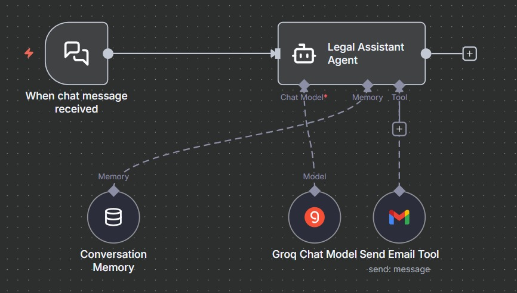
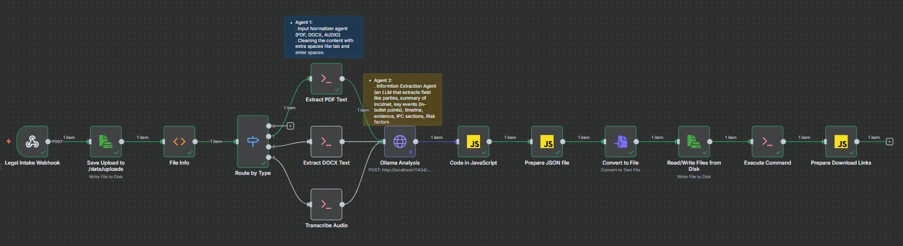
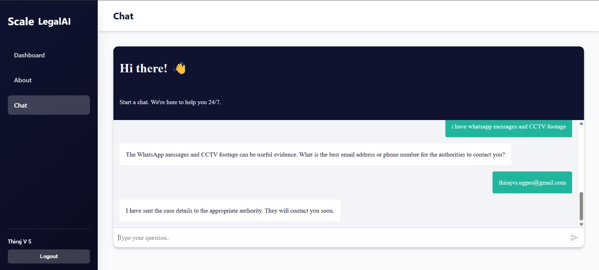
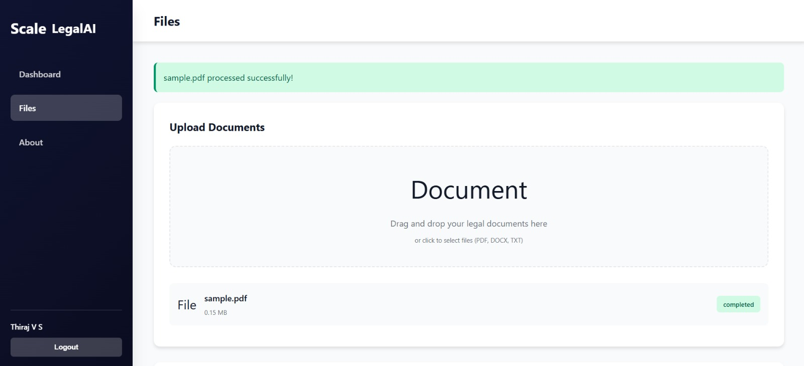
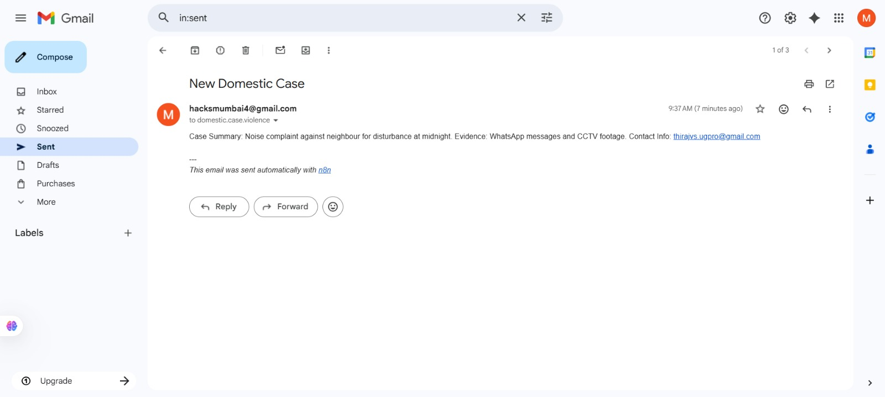
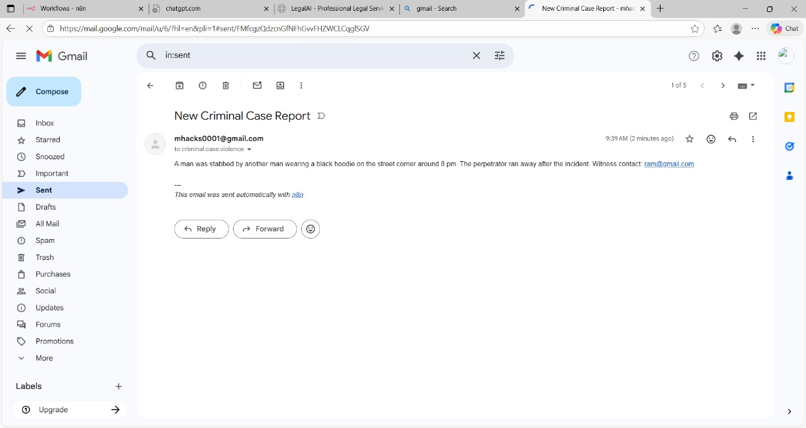

# LegalSum-AI

An AI-powered legal document analysis platform that automates legal document summarization, structured information extraction, workflow automation, and report generation using Ollama, Mistral 7B, Python, Docker, and n8n.

---

## Features

- Upload PDF, DOCX, or Audio evidence
- Offline AI-powered legal analysis using Ollama + Mistral 7B
- Structured extraction of legal information
- Automatic PDF, DOCX, PDF and Excel report generation
- AI-powered Legal Assistant for client case intake
- Automated email routing using n8n workflows
- End-to-end workflow automation
- Offline processing for improved privacy

---

## Architecture

- HTML Frontend for document upload
- n8n orchestrates the complete workflow
- Python scripts extract text from PDF, DOCX and Audio
- Ollama runs the local Mistral 7B model
- JavaScript nodes process and validate AI responses
- Reports are generated in JSON, DOCX, PDF and Excel formats
- Download links are returned to the user

---

## Technology Stack

### AI

- Ollama
- Mistral 7B
- Whisper

### Workflow Automation

- n8n

### Backend

- Python
- JavaScript

### Frontend

- HTML
- CSS
- JavaScript

### Libraries

- pdfplumber
- python-docx
- ReportLab
- openpyxl

### Deployment

- Docker

---

## Project Structure

```text
LegalSum-AI
│
├── backend
│   ├── extract_pdf.py
│   ├── extract_docx.py
│   ├── transcribe.py
│   └── json_to_all.py
│
├── frontend
│   └── legal_ai_platform.html
│
├── workflows
│   ├── Lawyer_Document_Workflow.json
│   └── Client_Legal_Assistant.json
│
├── screenshots
│
├── requirements.txt
├── .gitignore
└── README.md
```

---

## AI Output

The generated legal report contains:

- Parties
- Incident Summary
- Key Facts
- Evidence
- IPC Sections
- Timeline
- Red Flags
- Recommendations
- Final Summary

---

## Screenshots

### Lawyer Document Analysis Workflow



### AI Legal Assistant Workflow



### Frontend




### Generated Reports





---

## Installation

```bash
git clone https://github.com/yourusername/LegalSum-AI.git

cd LegalSum-AI

pip install -r requirements.txt
```

Start Ollama

```bash
ollama run mistral:7b-instruct-q4_K_M
```

Import both n8n workflows and open the frontend.

---

## Future Improvements

- OCR support
- Multi-language legal analysis
- User authentication
- Cloud deployment
- Case management dashboard
- Advanced legal citation extraction

---

## License

MIT License

---

## Author

Jayasree

Information Technology Undergraduate

Coimbatore Institute of Technology
